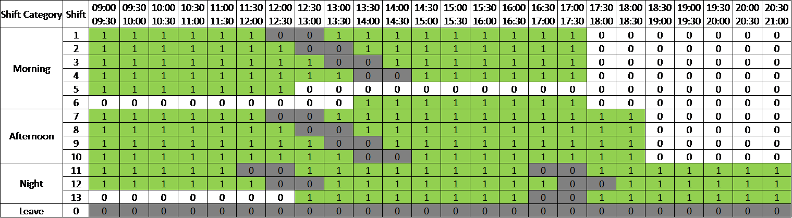
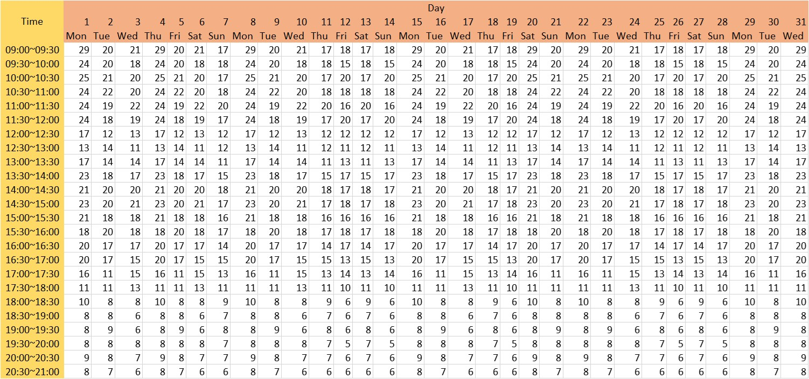

# Operations Research
# 題目來源
臺灣大學資訊管理學系孔令傑老師-作業研究課程，已獲授權將題目放置於GitHub

# 題目簡介
[完整題目描述](./doc/OR108-2_case01.pdf)<br>
[完整題目描述](./doc/OR108-2_case02.pdf)<br>
## 需求背景
一公司的面臨客服人員需求數量大於現有客服人員數的難題，公司經理正煩惱該如何為客服人員排班以使缺工情形最低。

## 公司現狀
*	共有40名客服人員
*	服務時間由9:00至21:00，以半小時劃分為個工時單位。共有14個班別，且每個班別屬於一個班別種類 （e.g. 早班）。如表1所示

表1: 班表

## 排班限制
* 每個客服人員1個月必須至少休假8天
* 每個客服人員每7天必須至少休假1天
* 每個客服人員每個星期至多被排1天晚班
* 每個客服人員每個星期至多被排2天下午班

## 任務目標
針對一個月中的每一天，推薦公司每一個班別要各安排幾個人工作。使得該月份總缺工人數最少。

# 解題思路簡介
[完整解題邏輯](./doc/Solution_2.pdf)

## 概念
把排程問題化作線性問題，接著使用Python引入Gurobi解算器計算出最佳解。

## 限制
線性問題的先天限制是在维持解方效能的情形下，無法限制最佳解為整數解，針對此問題，我所開發的程式會直接產出小數型態的最佳解，將調整的彈性留給管理部門。


## 解方介紹
### 定義變數
* ：在日期d中需要為班別s安別的客服人員人數

* ：在日期d的時段p，公司的缺工程度，以(需求人數) - (推薦派駐人數)表示。

* ：代表
的正值，由於
的負值代表客服 人數充沛，無缺工情形。因此在探討缺工情況的本情境中無須討論
的負值。

* ：表缺工人數總合，公式為

### 定義環境參數
* ：班別s包含的時段p資訊。如表1所示

* ：在日期d的時段p，經理預估共需要多少為客服人員，如表2所示

表2: 理想客服人數

### 定義目標函式
Minimize	

### 限制式
* 確保是的正值


* 每個月休8天


* 每7天休息1天


* 每星期至多1晚班


* 每星期至多2下午班


* 

* 

### Note
在上面的公式中，若Sigma的上界為i6等形式，他們的實際值為i+6。因為Latex會自動省略{}中的加號，所以才顯示不出來。

# 如何執行
## 前置步驟 - 安裝解算器Gurobi
1. 安裝Guroibi<br>
可參考成功大學李家岩老師的[作業研究課程](https://github.com/wurmen/Gurobi-Python/blob/master/Installation/安裝教學.md)

## 其他dependencies
* openpyxl
* pandas
* numpy

## 產出結果
在CMD中輸入

```{bash}
python3 solution.py
```

若要對其他資料進行處理，使用編輯器打開solution.py，更改全域變數dataFile_path在重複以上步驟即可。


# 小組成員
* [蕭昀豪](https://github.com/Howard-Hsiao)
* 鍾詔東
* 李佩霙
* 周正傑
